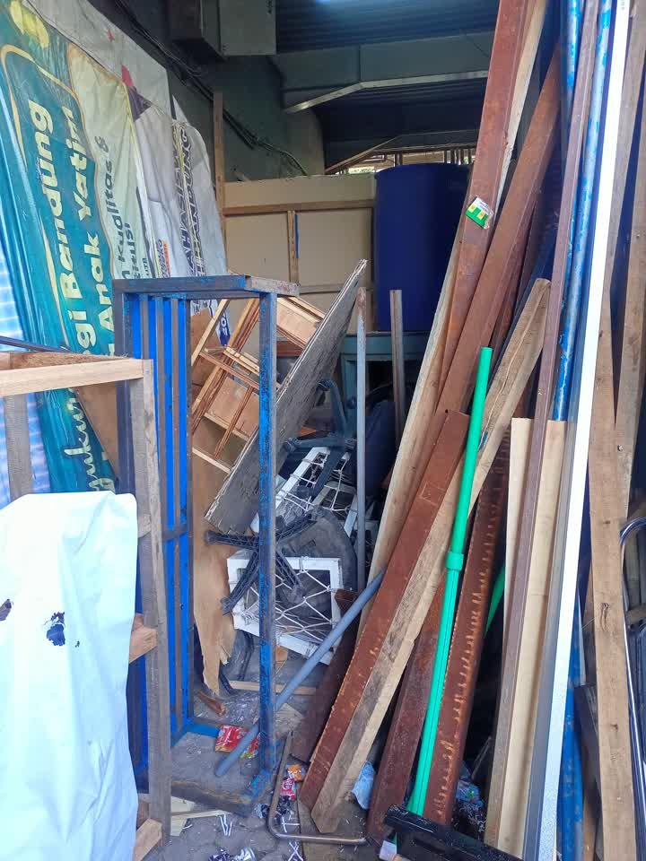
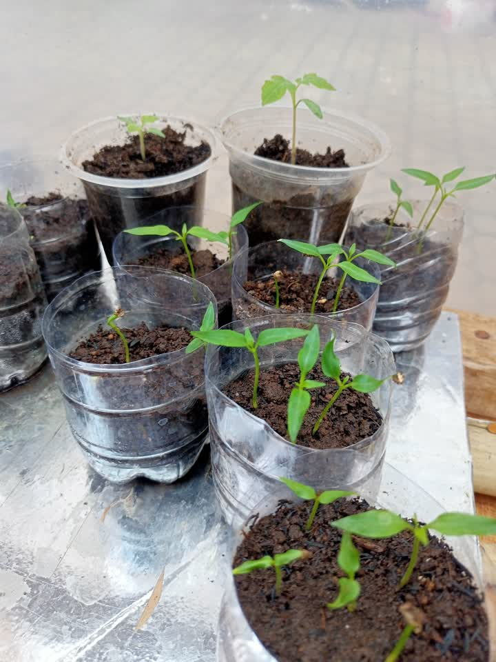
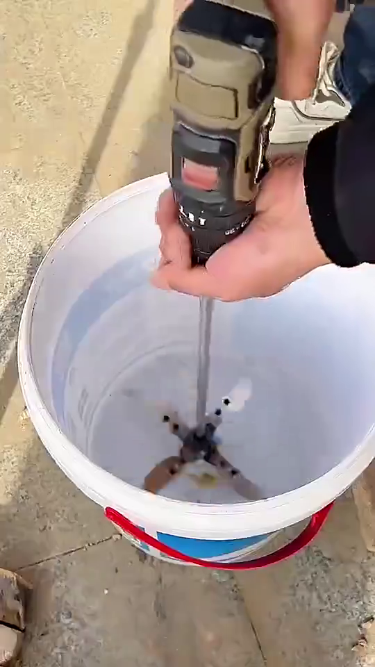

# Sabtu, 18 Oktober 2025

## Bahan diskusi

* Sampah
* Barang bekas tak terpakai
* Ruang Simulasi Iklim
* Smart Campus
* Green House

## Note

1. **Sofa Bekas dan Barang Bekas**

   
   

   - Untuk kayu akan di pilah mana yang bisa digunakan kembali dan bagian yang tidak layak digunakan kembali akan di bakar.
   - Bursa dan bahan lainya (layak guna) di amankan
2. **Pengambilan sampah dari pengelola external**

   

   Jika lebih dari satu minggu belum diangkut maka sampah akan di bakar secara berkala

   1 hari 7 trash bag, pengankutan 1 x seminggu.
3. **Pemilahan Sampah**

   - Pengujian pemilah sampah botol (plastik dan logam/metal)

     <video width="320" controls>
         <source src="./diskusi/img/percobaan-pemilah-botol.mp4" type="video/mp4">
      </video>
   - Memulai perancangan Pemilah sampah secara umum menggunakan Computer Vision

     <video width="320" controls>
         <source src="./diskusi/img/percobaan-computer-vision.mp4" type="video/mp4">
      </video>
4. **Daur Ulang atau Pengolahan**

   - Botol Plastik

     
     

     | Solusi              | Alur                                                            | Note |
     | ------------------- | --------------------------------------------------------------- | ---- |
     | Jual Hasil Cacah    | Sampah botol di hancurkan menggunakan mesin pencacah            |      |
     | Jual Utuh           | Sampah botol di pilah dengan tutupnya                           |      |
     | Di lelehkan         | Sampah botol di lelehkan untuk jadi bahan cetak produk tertentu |      |
     | Filament 3D Printer | -                                                               |      |
   - Organik

     | Solusi | Alur                                                 | Note |
     | ------ | ---------------------------------------------------- | ---- |
     | Pupuk  | Sampah botol di hancurkan menggunakan mesin pencacah |      |
   - Kayu
5. **Smart Campus**

   - Sheryl & Aima: Deep Learning Mengubah Teks Menjadi Video/GIF Bahasa Isyarat
   - Rifky: Deteksi posisi kebakaran sensor, alat semprot air.
   - M Dimas dan Aridwan: Deep Learning Video ke Text (handle semua / cari 1 orang teman lagi)
   - Dzikri: Deteksi Mengantuk pada Kendaraan (handle semua / cari 1 orang teman lagi)
   - Syukrilah, Ahmad dan Nizar: Computer Vision Filter sampah Otomatis menggunakan YOLO
6. **Green House**

   
   
   
7. **Ruang Simulasi Iklim**

   - Mahasiswa yang mencatat / mengambil data dapat mempengaruhi fokus orang yang sedang melakukan simulasi
   - Nilai tidak  begitu stabil karena fokus terganggu
   - Penacacatan manual rawan hialang dan tidak terstruktur, kerana data akan di kumpulkan dan di analisis

   
   
   
   
   
   
   

   Saran

   - Penerapan sistem berbasis IoT, guna memudahkan pengumpulan data.
   - Penggunaan Sensor dan Aktuator untuk menunjang Monitoring dan Kendali Ruangan.
   - Pembuatan Simulasi Suara agar simulasi lebih nyata.
   - Alat berbasis Portable, guna mempermudah penyesuaian dari keinginan pengguna sistem.
   - Pembuatan Server Lokal guna memudahkan pengelolaan dan akses Data.

## Note

- Pemilah Sampah, sift pagi jam 13:00, sift siang jam 20:00
- Pembakaran,

# SIKLUS PENGOLAHAN SAMPAH

# SAMPAH ORGANIK

## 1. Eco-Enzyme

### Takaran

| No | Bahan      | Jumlah |
| -- | ---------- | ------ |
| 1  | Air        | 60%    |
| 2  | Bahan Baku | 30%    |
| 3  | Gula Merah | 10%    |

### Proses Pembuatan

## 2. Kompos

### Takaran (Aktivator)

| No | Bahan      | Jumlah |
| -- | ---------- | ------ |
| 1  | Air        | 80%    |
| 2  | EM4        | 10%    |
| 3  | Gula Merah | 10%    |

### Proses Pembuatan

## 3. Kalkulator

**klik link/tombol dibawah*

## 4. Pencacah Sampah Organik Kasar/Halus

- Alat Portable
- Ukuran ember bisa di sesuaikan
- Perawatan mudah
- Ukuran dan Jumlah pisau bisa di Custom
- Mesin penggerak menggunakan Mesin Bor atau sejenisnya
- Harga kisaran 70k

# SAMPAH BOTOL

## 1. Botol PLastik

## 2. Tutup Botol PLastik

## 3. Botol Kaleng

## 1. Disabilitas Fisik (mobilitas terbatas)

## 2. Disabilitas Netra / Buta (sensorik)

## 3. Disabilitas Rungu / Wicara

## 4. Disabilitas Mental / Jiwa (psikososial)

## 5. Disabilitas Intelektual & Ganda

## 6. Solusi lintas-disabilitas (berguna untuk banyak tipe)

# IDE TUGAS UAS MIKROKONTROLER

### 1. **Sistem Absensi Otomatis Berbasis RFID/NFC**

**Deskripsi:**

Mahasiswa cukup menempelkan kartu RFID/NFC ke pembaca (reader), sistem otomatis mencatat nama, NIM, dan waktu hadir ke database.

**Komponen:** RFID reader (RC522), tag/kartu RFID, mikrokontroler (ESP32/Arduino), LCD atau web dashboard.

**Output:** Data absensi tersimpan otomatis dan dapat diakses dosen melalui web/app.

---

### 2. **Panel Pengumuman Digital**

**Deskripsi:**

Papan pengumuman elektronik menampilkan jadwal kuliah, pengumuman penting, atau event kampus secara real-time melalui koneksi Wi-Fi.

**Komponen:** ESP32, modul LED matrix / OLED / e-ink display.

**Output:** Tampilan teks atau gambar pengumuman yang dapat diubah dari server/web.

---

### 3. **Sistem Parkir Mini (Monitoring Slot Parkir)**

**Deskripsi:**

Sistem pendeteksi slot parkir kosong/terisi menggunakan sensor jarak. Data dikirim ke layar atau web untuk membantu pengguna.

**Komponen:** Ultrasonic sensor, ESP32, LED indikator, LCD atau web panel.

**Output:** Tampilan jumlah slot kosong dan peta lokasi parkir.

---

### 4. **Pendeteksi Kualitas Udara (CO₂/PM2.5)**

**Deskripsi:**

Mengukur kualitas udara di area kampus (CO₂, debu, suhu, kelembapan) dan menampilkan hasil digital serta mengirim data ke server.

**Komponen:** Sensor MQ-135/SDS011, DHT22, ESP32, display OLED.

**Output:** Nilai CO₂/PM2.5 real-time dan grafik tren di web dashboard.

---

### 5. **Monitoring Konsumsi Listrik per Ruangan**

**Deskripsi:**

Alat yang memantau penggunaan daya listrik (tegangan, arus, daya) di tiap ruangan kampus.

**Komponen:** Sensor arus (ACS712), sensor tegangan (ZMPT101B), ESP32.

**Output:** Tabel/grafik pemakaian listrik per jam/hari.

---

### 6. **Sistem Lampu Jalan Otomatis**

**Deskripsi:**

Lampu otomatis menyala saat malam dan mati saat siang atau ketika ada gerakan terdeteksi.

**Komponen:** Sensor LDR, sensor PIR, relay, ESP32.

**Output:** Lampu hemat energi yang bekerja otomatis sesuai kondisi lingkungan.

---

### 7. **Pendeteksi Kebisingan (Noise Logger)**

**Deskripsi:**

Alat mencatat tingkat kebisingan di area kampus dan menyimpan data untuk analisis.

**Komponen:** Sensor suara (MAX4466/LM393), ESP32, SD card module.

**Output:** Data dB (desibel) yang tersimpan dan bisa ditampilkan dalam grafik.

---

### 8. **Sistem Deteksi Kebocoran Air**

**Deskripsi:**

Sensor mendeteksi air di area tertentu (lantai, pipa) dan mengirim notifikasi jika terjadi kebocoran.

**Komponen:** Water leak sensor, buzzer, ESP32.

**Output:** Alarm bunyi + notifikasi Telegram/web jika kebocoran terdeteksi.

---

### 9. **Smart Locker (Pinjam Alat Kampus)**

**Deskripsi:**

Loker otomatis yang dibuka menggunakan kartu RFID/NFC untuk meminjam dan mengembalikan alat laboratorium.

**Komponen:** RFID reader, solenoid lock, ESP32, LCD display.

**Output:** Data pengguna + waktu peminjaman tersimpan otomatis.

---

### 10. **Sistem Antrean Digital**

**Deskripsi:**

Sistem antrean dengan nomor panggilan otomatis, layar tampilan, dan suara pemanggilan.

**Komponen:** ESP32, display OLED/7-segment, speaker, tombol next.

**Output:** Tampilan nomor antrean dan suara otomatis “Nomor X silakan ke loket”.

---

### 11. **Sistem Irigasi Otomatis untuk Vertical Garden**

**Deskripsi:**

Penyiraman tanaman otomatis berdasarkan tingkat kelembapan tanah.

**Komponen:** Soil moisture sensor, pompa mini, ESP32.

**Output:** Pompa menyala saat tanah kering dan berhenti saat lembab.

---

### 12. **Pendeteksi Asap & Alarm Dini**

**Deskripsi:**

Sistem mendeteksi adanya asap di bengkel atau lab, memicu alarm dan notifikasi.

**Komponen:** Sensor asap (MQ-2), buzzer, ESP32.

**Output:** Alarm bunyi + indikator LED + notifikasi Telegram/web.

---

### 13. **Stasiun Isi Ulang Air Minum Otomatis**

**Deskripsi:**

Mesin otomatis mengisi botol sesuai volume tertentu dan menghentikan aliran saat penuh.

**Komponen:** Sensor ultrasonik/flow sensor, pompa, relay, ESP32.

**Output:** Volume air terisi sesuai takaran + display volume.

---

### 14. **Sistem Irigasi Otomatis Berbasis Kelembapan**

**Deskripsi:**

Mirip poin 11 tapi lebih fokus pada kebun luar ruangan dengan area luas.

**Komponen:** Soil moisture sensor, solenoid valve, ESP32.

**Output:** Grafik kelembapan dan status penyiraman otomatis.

---

### 15. **Sistem Ventilasi Otomatis**

**Deskripsi:**

Kipas atau jendela otomatis aktif sesuai suhu dan kelembapan ruangan.

**Komponen:** DHT22, servo motor, kipas DC, ESP32.

**Output:** Otomatis buka jendela/nyalakan kipas saat panas dan lembab.

---

### 16. **Miniatur Pembangkit Listrik Tenaga Surya**

**Deskripsi:**

Miniatur panel surya dengan sistem pelacak matahari agar selalu menghadap sinar optimal.

**Komponen:** LDR x2, motor servo, panel surya mini, ESP32.

**Output:** Panel bergerak otomatis mengikuti arah cahaya.

---

### 17. **Miniatur Pembangkit Listrik Tenaga Air**

**Deskripsi:**

Model turbin air kecil untuk menghasilkan listrik, menampilkan tegangan/arus yang dihasilkan.

**Komponen:** Turbin air mini, generator DC, multimeter digital, ESP32.

**Output:** Tampilan daya listrik hasil aliran air.

---

### 18. **Pintu Otomatis**

**Deskripsi:**

Pintu terbuka otomatis dengan sensor gerak atau akses RFID.

**Komponen:** PIR sensor / RFID, motor servo, ESP32.

**Output:** Pintu terbuka otomatis saat orang mendekat atau kartu terdeteksi.

---

### 19. **Miniatur Kampus Pintar**

**Deskripsi:**

Model kampus skala kecil dengan sistem penerangan, pintu, dan kontrol suara via Google Home atau web.

**Komponen:** ESP32, relay, LED, servo, modul IoT.

**Output:** Simulasi sistem otomasi kampus dengan kontrol pintar.

---

### 20. **Wastafel Cuci Tangan Otomatis**

**Deskripsi:**

Sensor mendeteksi tangan lalu mengaktifkan aliran air dan hand sanitizer otomatis.

**Komponen:** IR sensor, pompa mini, relay, ESP32.

**Output:** Air dan sanitizer keluar otomatis tanpa sentuhan.

---

### 21. **CCTV ESP32 Cam dengan Telegram Bot**

**Deskripsi:**

Kamera ESP32 Cam mengirimkan foto/video real-time ke Telegram jika mendeteksi gerakan.

**Komponen:** ESP32 Cam, sensor PIR.

**Output:** Gambar atau video terkirim otomatis ke Telegram.

---

### 22. **Monitoring Kondisi Lingkungan Kampus**

**Deskripsi:**

Alat memantau suhu, kelembapan, tekanan udara, dan hujan secara online.

**Komponen:** DHT22, rain sensor, BMP280, ESP32.

**Output:** Dashboard online menampilkan kondisi lingkungan real-time.

---

### 23. **Deteksi Objek Gerak di Kelas**

**Deskripsi:**

Sistem pendeteksi keberadaan orang/mahasiswa di kelas untuk menghitung jumlah atau memicu sistem lain (misal lampu otomatis).

**Komponen:** PIR sensor, ultrasonic, ESP32, LED.

**Output:** Tampilan jumlah orang di ruangan dan lampu menyala otomatis.

---

### 24. **Smart Trash Bin (Tempat Sampah Pintar)**

**Deskripsi:**

Tempat sampah yang otomatis membuka tutup saat ada tangan atau benda mendekat, dan memberi notifikasi ketika penuh.

**Komponen:** Ultrasonic sensor, servo motor, ESP32, sensor berat (load cell).

**Output:** Tutup terbuka otomatis + peringatan “Tempat Sampah Penuh” di display/web.

---

### 25. **Sistem Pendeteksi Banjir Miniatur**

**Deskripsi:**

Prototipe sistem deteksi tinggi air di parit atau saluran kampus dengan alarm dan notifikasi dini.

**Komponen:** Ultrasonic sensor, buzzer, ESP32.

**Output:** Tampilan ketinggian air real-time + alarm saat level bahaya.

---

### 26. **Smart Door Lock Berbasis Password & RFID**

**Deskripsi:**

Kunci pintu otomatis yang bisa dibuka dengan password keypad atau kartu RFID, dilengkapi sistem keamanan jika salah input.

**Komponen:** Keypad 4x4, RFID RC522, servo, ESP32.

**Output:** Solenoid/servo membuka pintu sesuai autentikasi valid.

---

### 27. **Smart Desk (Meja Pintar Mahasiswa)**

**Deskripsi:**

Meja belajar dilengkapi sensor cahaya dan suhu untuk mengatur lampu serta kipas otomatis sesuai kondisi ruangan.

**Komponen:** LDR, DHT11, relay, ESP32.

**Output:** Lampu dan kipas nyala otomatis, data kondisi ruangan ditampilkan di OLED.

---

### 28. **Smart Class Automation**

**Deskripsi:**

Sistem otomatisasi ruang kelas: lampu, kipas, dan proyektor aktif otomatis saat kelas dimulai atau terdeteksi orang.

**Komponen:** PIR sensor, relay module, ESP32, timer RTC DS3231.

**Output:** Ruangan hemat energi karena perangkat menyala sesuai jadwal atau kehadiran.

---

### 29. **Sistem Keamanan Sepeda di Area Kampus**

**Deskripsi:**

Sistem alarm sepeda yang aktif saat ada gerakan mencurigakan, dengan notifikasi ke HP melalui Telegram.

**Komponen:** MPU6050 (sensor gerak), buzzer, ESP32, Telegram bot API.

**Output:** Alarm bunyi + pesan Telegram saat sepeda digerakkan tanpa izin.

---

### 30. **Smart Energy Logger (Pencatat Energi Otomatis)**

**Deskripsi:**

Alat pencatat penggunaan energi listrik tiap jam yang tersimpan di SD card atau dikirim ke server.

**Komponen:** Sensor arus ACS712, ESP32, modul SD card.

**Output:** Log data daya (Watt) otomatis untuk analisis efisiensi listrik kampus.
