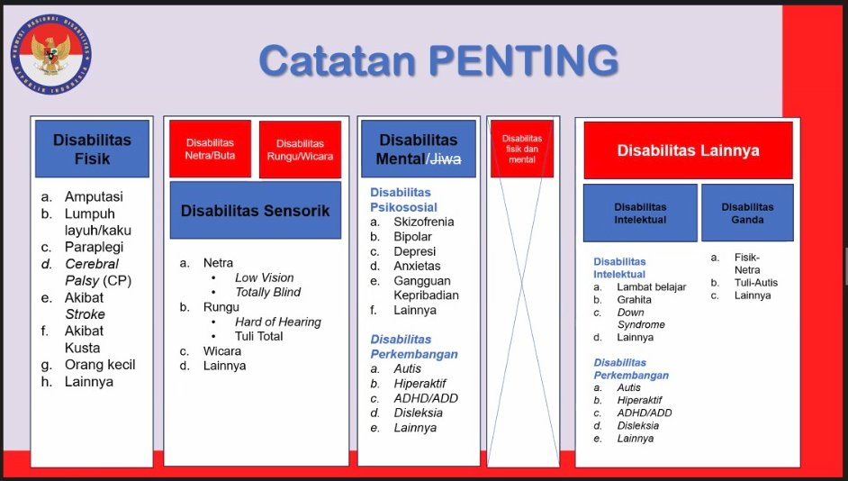

# Inovasi untuk Disabilitas

### 💪 1. Disabilitas Fisik

**Masalah:** Mobilitas terbatas (amputasi, lumpuh, stroke, dsb).

**Inovasi yang bisa dikembangkan:**

* **Kursi roda pintar (smart wheelchair)** berbasis sensor ultrasonik dan kontrol suara.
* **Prostetik adaptif** dengan kontrol otot (EMG sensor).
* **Aplikasi pengingat terapi fisik** dengan panduan latihan interaktif.

---

### 👁️👂 2. Disabilitas Sensorik (Netra/Buta & Rungu/Wicara)

**Masalah:** Kesulitan berinteraksi dengan lingkungan atau komunikasi.

**Inovasi:**

* **Kacamata pintar untuk tunanetra** dengan sensor jarak dan deteksi objek berbasis AI.
* **Aplikasi penerjemah bahasa isyarat ke teks/suara (dan sebaliknya)** .
* **Navigasi indoor berbasis suara dan GPS lokal** untuk tunanetra di gedung kampus.

---

### 🧠 3. Disabilitas Mental / Jiwa

**Masalah:** Gangguan fokus, emosi, atau komunikasi sosial.

**Inovasi:**

* **Aplikasi pemantau kesehatan mental** dengan mood tracker dan rekomendasi aktivitas.
* **Game edukatif berbasis terapi perilaku** untuk anak autis atau ADHD.
* **Wearable sensor** untuk mendeteksi stres atau kecemasan (berdasarkan detak jantung & suhu kulit).

---

### 🧩 4. Disabilitas Intelektual dan Ganda

**Masalah:** Keterlambatan belajar, kesulitan memahami informasi kompleks.

**Inovasi:**

* **Platform pembelajaran adaptif** dengan tampilan sederhana dan interaktif.
* **Asisten belajar berbasis AI** yang bisa membaca teks dan menjelaskan dengan suara.
* **Smart toy edukatif** yang membantu stimulasi kognitif anak disabilitas ganda.

---
