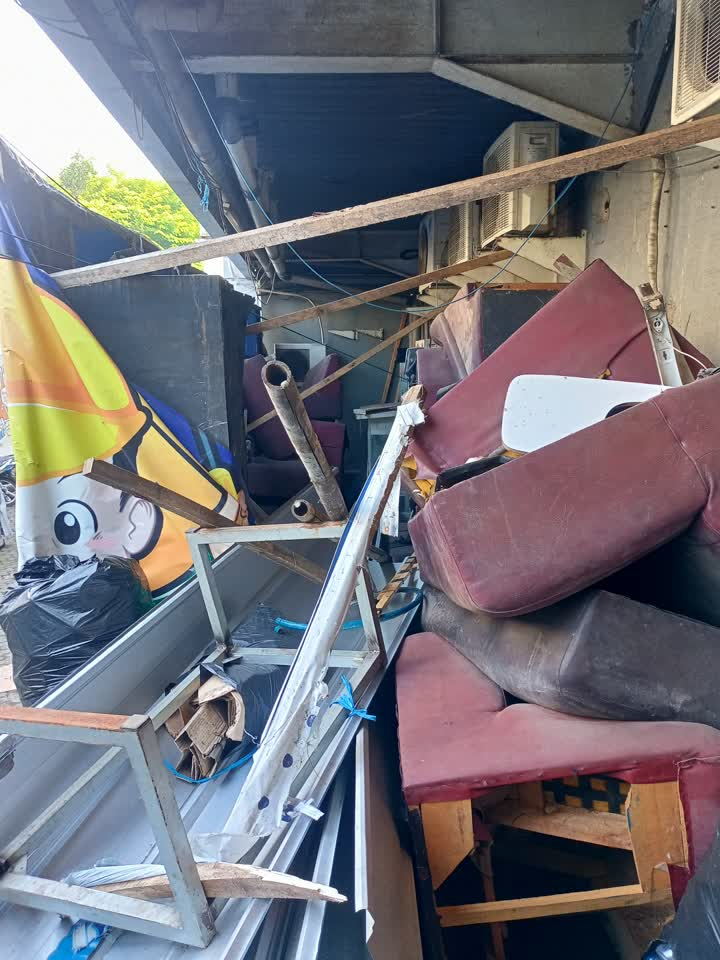
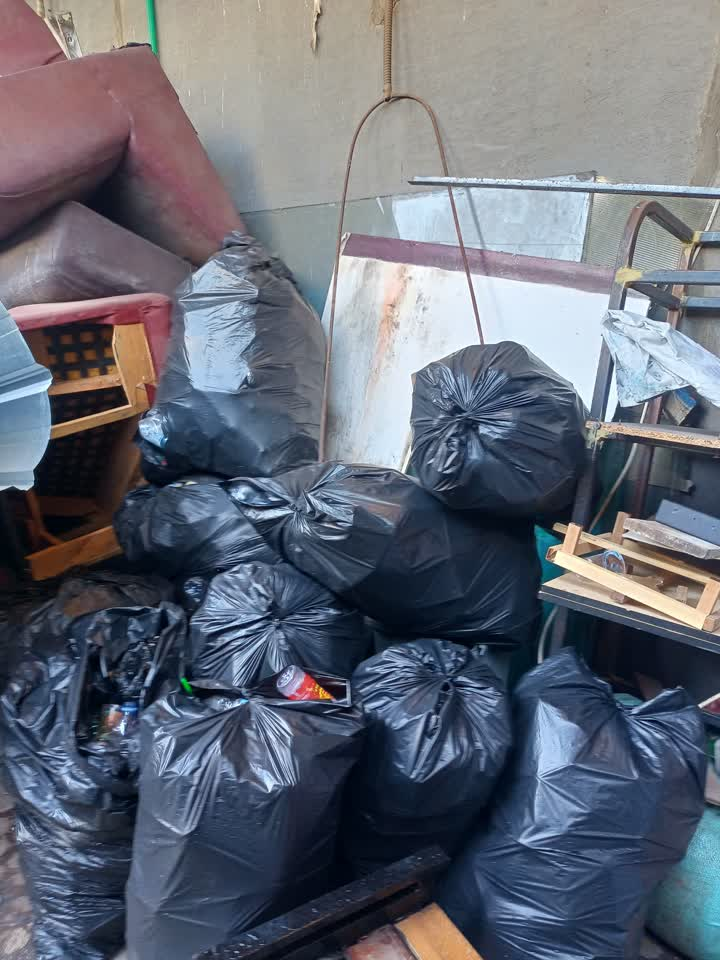
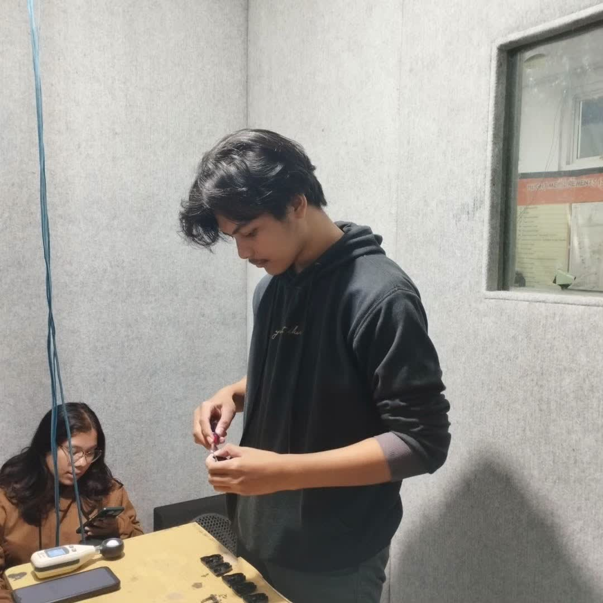

# Sabtu, 18 Oktober 2025

## Bahan diskusi

* Sampah
* Barang bekas tak terpakai
* Ruang Simulasi Iklim
* Smart Campus
* Green House

## Note

1. **Sofa Bekas dan Barang Bekas**

   
   

   - Untuk kayu akan di pilah mana yang bisa digunakan kembali dan bagian yang tidak layak digunakan kembali akan di bakar.
   - Bursa dan bahan lainya (layak guna) di amankan
2. **Pengambilan sampah dari pengelola external**

   

   Jika lebih dari satu minggu belum diangkut maka sampah akan di bakar secara berkala

   1 hari 7 trash bag, pengankutan 1 x seminggu.
3. **Pemilahan Sampah**

   - Pengujian pemilah sampah botol (plastik dan logam/metal)

     <video width="320" controls>
         <source src="./img/percobaan-pemilah-botol.mp4" type="video/mp4">
      </video>
   - Memulai perancangan Pemilah sampah secara umum menggunakan Computer Vision

     <video width="320" controls>
         <source src="./img/percobaan-computer-vision.mp4" type="video/mp4">
      </video>
4. **Daur Ulang atau Pengolahan**

   - Botol Plastik

     
     

     | Solusi              | Alur                                                            | Note |
     | ------------------- | --------------------------------------------------------------- | ---- |
     | Jual Hasil Cacah    | Sampah botol di hancurkan menggunakan mesin pencacah            |      |
     | Jual Utuh           | Sampah botol di pilah dengan tutupnya                           |      |
     | Di lelehkan         | Sampah botol di lelehkan untuk jadi bahan cetak produk tertentu |      |
     | Filament 3D Printer | -                                                               |      |
   - Organik

     | Solusi | Alur                                                 | Note |
     | ------ | ---------------------------------------------------- | ---- |
     | Pupuk  | Sampah botol di hancurkan menggunakan mesin pencacah |      |
   - Kayu
5. **Smart Campus**

   - Sheryl & Aima: Deep Learning Mengubah Teks Menjadi Video/GIF Bahasa Isyarat
   - Rifky: Deteksi posisi kebakaran sensor, alat semprot air.
   - M Dimas dan Aridwan: Deep Learning Video ke Text (handle semua / cari 1 orang teman lagi)
   - Dzikri: Deteksi Mengantuk pada Kendaraan (handle semua / cari 1 orang teman lagi)
   - Syukrilah, Ahmad dan Nizar: Computer Vision Filter sampah Otomatis menggunakan YOLO
6. **Green House**

   
   
   
7. **Ruang Simulasi Iklim**

   - Mahasiswa yang mencatat / mengambil data dapat mempengaruhi fokus orang yang sedang melakukan simulasi
   - Nilai tidak  begitu stabil karena fokus terganggu
   - Penacacatan manual rawan hialang dan tidak terstruktur, kerana data akan di kumpulkan dan di analisis

   
   
   
   
   
   
   

   Saran

   - Penerapan sistem berbasis IoT, guna memudahkan pengumpulan data.
   - Penggunaan Sensor dan Aktuator untuk menunjang Monitoring dan Kendali Ruangan.
   - Pembuatan Simulasi Suara agar simulasi lebih nyata.
   - Alat berbasis Portable, guna mempermudah penyesuaian dari keinginan pengguna sistem.
   - Pembuatan Server Lokal guna memudahkan pengelolaan dan akses Data.

## Note

- Pemilah Sampah, sift pagi jam 13:00, sift siang jam 20:00
- Pembakaran,
