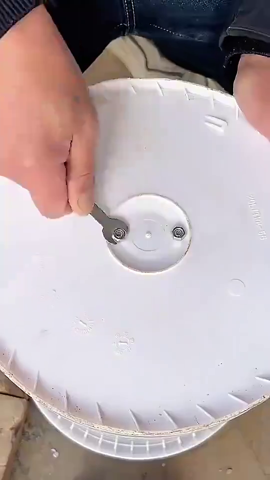
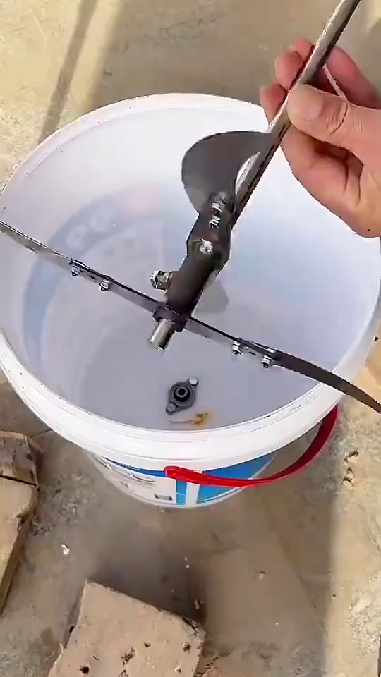
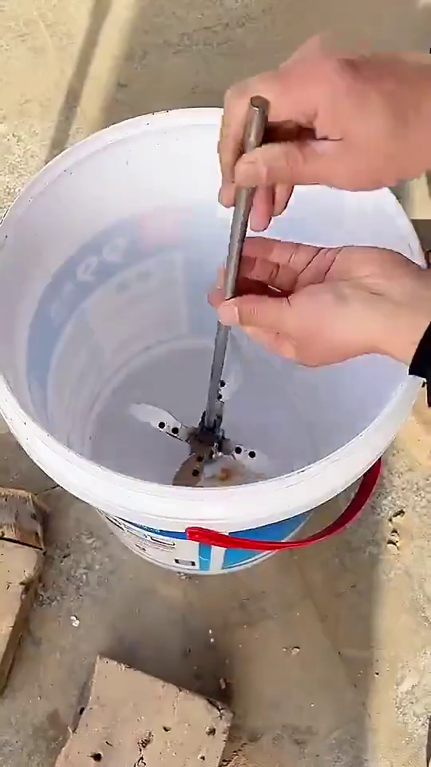

# SIKLUS PENGOLAHAN SAMPAH

# SAMPAH ORGANIK

## 1. Eco-Enzyme

### Takaran

| No | Bahan      | Jumlah |
| -- | ---------- | ------ |
| 1  | Air        | 60%    |
| 2  | Bahan Baku | 30%    |
| 3  | Gula Merah | 10%    |

### Proses Pembuatan

## 2. Kompos

### Takaran (Aktivator)

| No | Bahan      | Jumlah |
| -- | ---------- | ------ |
| 1  | Air        | 80%    |
| 2  | EM4        | 10%    |
| 3  | Gula Merah | 10%    |

### Proses Pembuatan

## 3. Kalkulator

**klik link/tombol dibawah*

## 4. Pencacah Sampah Organik Kasar/Halus

- Alat Portable
- Ukuran ember bisa di sesuaikan
- Perawatan mudah
- Ukuran dan Jumlah pisau bisa di Custom
- Mesin penggerak menggunakan Mesin Bor atau sejenisnya
- Harga kisaran 70k

# SAMPAH BOTOL

## 1. Botol PLastik

## 2. Tutup Botol PLastik

## 3. Botol Kaleng
